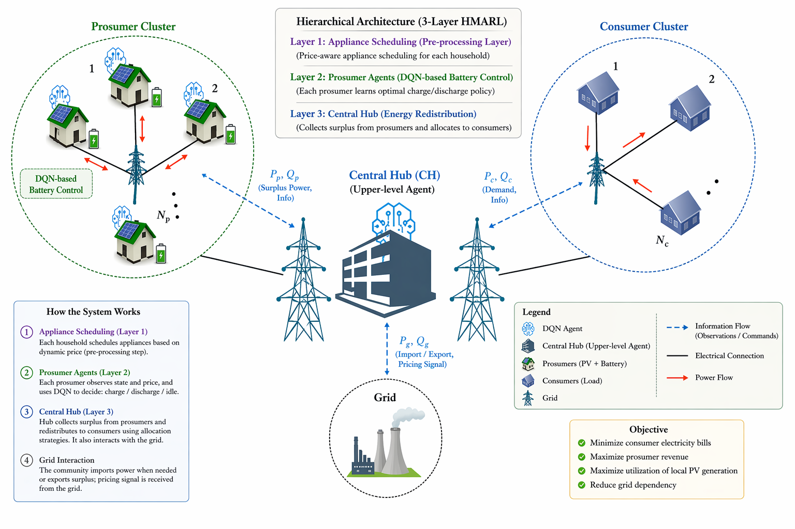

# HMARL Smart Grid Simulator

[](https://smartgrid-ten.vercel.app)
[](https://drive.google.com/file/d/1ec_vyEMBSiYLdbPeHpHzPNLiMbnkFlhd/view?usp=sharing)

> 🚀 **Live Interactive Web App**: [https://smartgrid-ten.vercel.app](https://smartgrid-ten.vercel.app)  
> 📜 **Accepted Research Paper (VDAT 2026)**: **"Hierarchical MARL with PV Forecasting and Dynamic Pricing in Smart Grids"** — Accepted at the *30th International Symposium on VLSI Design and Test (VDAT 2026)*.  
> 📄 **[Read Full Paper PDF](https://drive.google.com/file/d/1ec_vyEMBSiYLdbPeHpHzPNLiMbnkFlhd/view?usp=sharing)**

A deployable, interactive web simulator based on the research paper **Hierarchical MARL with PV Forecasting and Dynamic Pricing in Smart Grids**.

The project converts the paper into a visual 24-hour smart-grid simulation where prosumer homes with PV panels and batteries coordinate with consumer homes through a Central Hub. Users can change community size, PV intensity, demand pressure, battery capacity, electricity price, and Central Hub allocation strategy, then watch how the results change in real time.

## Problem Statement

Modern smart communities include both:

- **Prosumers**: households with PV generation and battery storage.
- **Consumers**: households with grid-only electricity demand.

Without coordination, surplus PV is wasted, exported externally at low value, or not shared fairly inside the community. Existing approaches often miss hierarchical coordination, integrated PV forecasting, flexible appliance scheduling, and configurable community-level energy redistribution.

The challenge is to build an intelligent energy-management system that can:

- reduce household electricity bills,
- improve local energy sharing,
- increase prosumer revenue,
- respond to dynamic time-of-use pricing,
- coordinate prosumers and consumers through a Central Hub,
- remain explainable through the paper's equations and results.

## Proposed Solution

This project implements a **3-layer HMARL smart-grid simulator**:

1. **Layer 1: Appliance Scheduling**
   - Price-aware greedy scheduling shifts flexible appliances to low-price windows.

2. **Layer 2: Prosumer DQN Battery Control**
   - Each prosumer observes local state:

   ```text
   s_h^t = [SoC_h^t, P_hat_PV,h^t, P_load,h^t, lambda^t, t_norm]
   ```

   - Each prosumer selects one battery action:

   ```text
   A = { CHARGE, DISCHARGE, IDLE }
   ```

3. **Layer 3: Central Hub Energy Redistribution**
   - The Central Hub collects surplus PV from prosumers and allocates it to consumers using:
     - Demand-First
     - Consumer-Priority
     - Prosumer-Priority

## Architectural Design

The project follows the HMARL architecture from the report:



## Research Paper Results Included

The simulator includes a dedicated **Results** page with the original paper-backed visuals and metrics.

Key report metrics:

| Metric | Conventional | Proposed HMARL |
| --- | ---: | ---: |
| Average household bill | ₹169.98/day | ₹133.02/day |
| Bill reduction | 0% | 21.7% |
| Peak demand | 37.58 kW | 37.58 kW |
| Prosumer revenue | ₹275.74 | ₹585.19 |
| Hub utilisation | 0% | 67.2% |
| DQN loss convergence | N/A | < 0.005 by step 2500 |

Included research visuals:

- scenario comparison,
- DQN training progress,
- PV utilisation breakdown,
- Central Hub allocation comparison.

## Interactive Features

The landing page is an animated simulator, not a static dashboard.

Users can change:

- reset the simulator to the paper default setup,
- number of prosumer homes,
- number of consumer homes,
- Central Hub strategy,
- PV intensity,
- load pressure,
- battery capacity,
- peak electricity price,
- simulation timeline.

The UI updates:

- animated energy flow,
- grid import/export,
- PV generation,
- Central Hub allocation,
- average SoC,
- average bill,
- bill reduction,
- prosumer revenue,
- grid dependency,
- community reward.

The simulator also includes hover hints on metrics and controls, plus a bottom
section explaining the standard assumptions and the expected increase/decrease
effect of each interactive parameter.

The **Set to default** button restores the paper simulation baseline:

- `N = 15` households: 7 prosumers and 8 consumers,
- PV ratings from 2 to 6 kW,
- battery capacity range from 8 to 15 kWh,
- 24-hour horizon with 96 steps at 15-minute resolution,
- Demand-First hub allocation,
- peak/off-peak tariff shown as ₹9.5/kWh and ₹5/kWh in the web UI.

## Multi-Page Structure

The project includes dedicated technical pages:

- `/` - interactive smart-grid simulator,
- `/guide` - layman's paper guide with analogies, glossary, and direct subsection navigation,
- `/technical` - formulas and mathematical formulation,
- `/algorithm` - HMARL and DQN training algorithm,
- `/implementation` - full-stack implementation architecture,
- `/results` - research paper metrics and figures.
- `/api/paper-config` - paper constants as JSON,
- `/api/synthetic-homes` - replaceable synthetic community records as JSON.

## Implementation Details

Current implementation:

- **Frontend**: React with Vinext/Next-compatible app routes.
- **Styling**: responsive custom CSS with dark and light mode.
- **Animation**: CSS/SVG-based animated energy-flow lines and 3D-like smart-community scene.
- **Simulation**: TypeScript implementation of the paper logic.
- **Synthetic data**: deterministic generated community profiles for PV, demand, appliances, and SoC.
- **API routes**: server endpoints expose paper constants and synthetic home records.
- **Deployment target**: Cloudflare Worker-compatible Sites build.

The implementation avoids hard-coded absolute file paths. Research images are copied into:

```text
public/research-assets/
```

## Synthetic Database and Real Data Replacement

The simulator begins with deterministic synthetic data so the project is portable and deployable without external services.

Synthetic fields include:

- home type,
- base demand,
- PV capacity,
- appliance participation,
- initial SoC,
- weather-inspired PV curve.

This can be replaced later with:

- real household load profiles,
- real PV generation data,
- weather features,
- SQL database records,
- CSV upload,
- API-fed smart-meter data.

The UI is designed around generic homes and time-series snapshots, so the data source can change without redesigning the visual simulator.

## Optimisation Logic

The project stays within the paper's optimisation structure:

- time-of-use price response,
- battery charge/discharge decisions,
- SoC constraints,
- PV utilisation reward,
- peak demand penalty,
- unmet demand penalty,
- Central Hub redistribution.

Reward function:

```text
R_h^t = -Cost_h^t
      + alpha * phi_PV,h^t
      - beta * phi_peak,h^t
      - gamma * phi_unmet,h^t

alpha = 0.3
beta = 0.2
gamma = 0.5
```

## Scalability

The default paper configuration starts with:

- 7 prosumer homes,
- 8 consumer homes,
- 24-hour horizon,
- 96 steps per episode.

The UI allows community size to change dynamically. The simulator recalculates metrics and redraws the animated layout whenever the number of homes changes.

## Run Locally Without npm

If npm fails because of package registry or DNS issues, run the dependency-free local server:

```bash
python3 server.py
```

Open:

```text
http://127.0.0.1:8000
```

The Python server also exposes:

```text
http://127.0.0.1:8000/api/paper-config
http://127.0.0.1:8000/api/synthetic-homes
```

## Run the React/Vinext Version

```bash
npm ci
npm run dev
```

If npm cache permissions are restricted, use a local cache:

```bash
npm ci --cache ./.npm-cache --logs-dir ./.npm-logs
npm run dev
```

## Build

```bash
npm run build
```

## Deploy on Vercel

This project includes a Vercel-specific static deployment path because the
local Vinext dependency install may fail on some machines.

The Vercel deployment uses:

- `vercel.json` to override install/build settings,
- `vercel-build.mjs` to prepare the `dist/` static output,
- `/api/paper-config` and `/api/synthetic-homes` as Vercel serverless functions,
- rewrites for `/guide`, `/technical`, `/algorithm`, `/implementation`, and `/results`.

Local Vercel build check:

```bash
npm run vercel:build
```

Deploy:

```bash
npx --registry https://registry.npmjs.org vercel login
npx --registry https://registry.npmjs.org vercel --prod
```

If Vercel asks for settings, use:

```text
Framework Preset: Other
Build Command: node vercel-build.mjs
Output Directory: dist
Install Command: echo "No dependency install required for static Vercel deployment"
```

## Citation & Publication

This project accompanies the research paper:

> **Hierarchical MARL with PV Forecasting and Dynamic Pricing in Smart Grids**  
> *Accepted for presentation at the 30th International Symposium on VLSI Design and Test (VDAT 2026).*  
> 📄 **[Read Full Paper on Google Drive](https://drive.google.com/file/d/1ec_vyEMBSiYLdbPeHpHzPNLiMbnkFlhd/view?usp=sharing)**

## Impact

This project demonstrates how AI-based smart-grid coordination can reduce household electricity cost, improve local energy sharing, and make community renewable-energy systems easier to understand through visual simulation.

Resume-ready summary:

> Built a deployable HMARL smart-grid simulator using DQN-style prosumer battery control, PV forecasting logic, dynamic pricing, Central Hub energy redistribution, and interactive full-stack visualisation.

